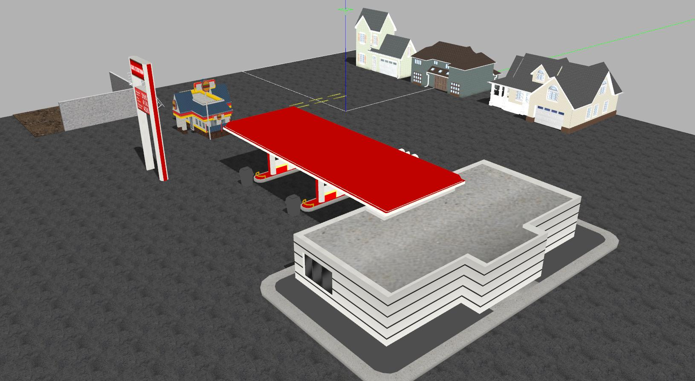

# Gazebo Worlds

***Shared, vehicle-independent Gazebo worlds for NanoBot simulation.***  
***NanoBot 仿真使用的通用、与机器人车型无关的 Gazebo 场景包。***



**Supported Platforms / 支持平台**

- ROS Noetic on Ubuntu 20.04
- Gazebo 11

**Worlds / 场景**

World files are stored in `worlds/`, and their preview images are available in `imgs/`.  
场景文件位于 `worlds/` 目录，对应的预览图片位于 `imgs/` 目录。

## Third-party / 第三方依赖

Install Gazebo and its ROS integration package.  
安装 Gazebo 及其 ROS 集成包：

```bash
sudo apt update
sudo apt install gazebo11 ros-noetic-gazebo-ros
```

Some worlds reference models from the official Gazebo model collection. Clone the
[Gazebo models repository](https://github.com/osrf/gazebo_models), then add it to
`GAZEBO_MODEL_PATH`.  
部分场景引用了 Gazebo 官方模型。请克隆
[Gazebo models 仓库](https://github.com/osrf/gazebo_models)，并将其加入
`GAZEBO_MODEL_PATH`：

```bash
git clone https://github.com/osrf/gazebo_models.git
export GAZEBO_MODEL_PATH="$GAZEBO_MODEL_PATH:/path/to/gazebo_models"
```

If you use additional custom models, append their directory in the same way. Models
installed with this package are exported to Gazebo automatically.  
如需使用其他自定义模型，可用相同方式追加模型目录。本包安装的模型会自动导出给 Gazebo。

To keep the setting across terminal sessions, add the `export` command to `~/.bashrc`.  
如需永久生效，请将 `export` 命令添加到 `~/.bashrc`。

## Build / 编译

Clone `nanobot_sim` into a catkin workspace and build it.  
将 `nanobot_sim` 克隆到 catkin 工作空间并完成编译：

```bash
mkdir -p ~/nanobot_ws/src
cd ~/nanobot_ws/src
git clone git@github.com:zhan994/nanobot_sim.git
cd ..
catkin_make
```

## Run / 启动

Source the workspace and launch the default world (`weston_robot_empty.world`).  
加载工作空间环境并启动默认场景（`weston_robot_empty.world`）：

```bash
cd ~/nanobot_ws
source devel/setup.bash
roslaunch gazebo_worlds world.launch
```

Select another world with the `world_name` argument.  
通过 `world_name` 参数选择其他场景：

```bash
roslaunch gazebo_worlds world.launch \
  world_name:=$(rospack find gazebo_worlds)/worlds/test_city.world
```

The launcher also forwards common Gazebo options. For example, run without the GUI:  
启动文件也支持常用的 Gazebo 参数。例如，无界面启动：

```bash
roslaunch gazebo_worlds world.launch \
  world_name:=$(rospack find gazebo_worlds)/worlds/uav_training.world \
  gui:=false headless:=true
```

Available options / 可用参数：`paused`, `use_sim_time`, `gui`, `headless`, `debug`,
and / 以及 `verbose`.

Vehicle launch files in `nanobot_sim` accept the same `world_name` argument. This lets
you switch shared worlds without modifying a launch file.  
`nanobot_sim` 中的机器人启动文件同样支持 `world_name` 参数，因此无需修改 launch
文件即可切换通用场景：

```bash
roslaunch diff_car_gazebo diff_car_gazebo.launch \
  world_name:=$(rospack find gazebo_worlds)/worlds/clearpath_playpen.world
```

## Related Work / 相关项目

- [Gazebo Models](https://github.com/osrf/gazebo_models)
- [AgileX Product Gazebo Simulate](https://github.com/leonhartyao/gazebo_models_worlds_collection)
